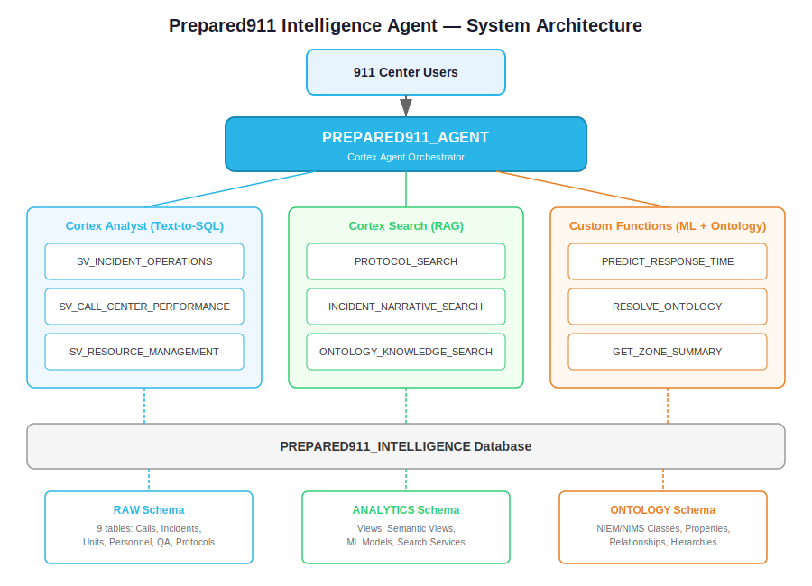
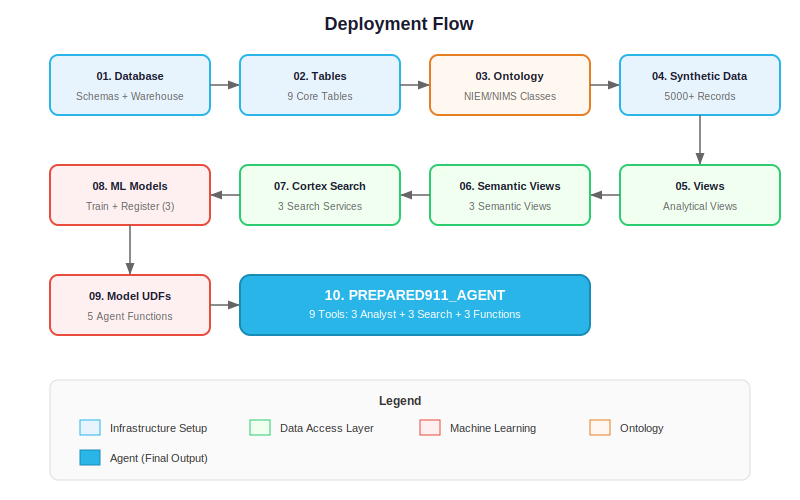
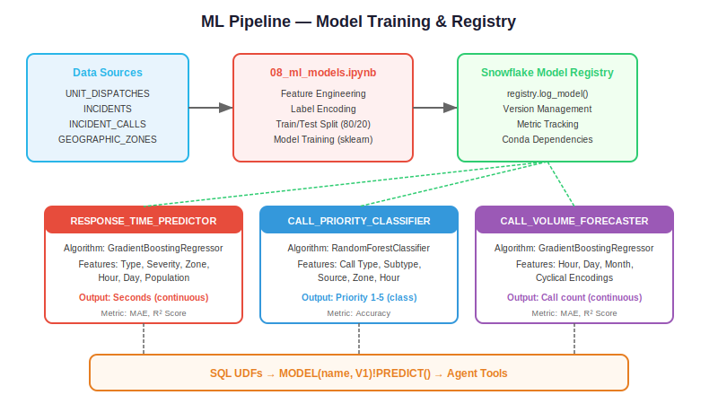

# Prepared911 Intelligence Agent

## Overview

The Prepared911 Intelligence Agent is a Snowflake-native AI system that enables emergency response agencies, 911 centers, and public safety stakeholders to interact with their operational data using natural language queries. Built on Snowflake's Cortex Agent framework, it combines structured data analytics, unstructured document search, and machine learning predictions into a unified conversational interface.

## Architecture



## Key Capabilities

| Capability | Technology | Description |
|-----------|-----------|-------------|
| Natural Language Queries | Cortex Analyst + Semantic Views | Ask questions about incidents, response times, call volumes in plain English |
| Document Search | Cortex Search Services | Search protocols, SOPs, and incident narratives semantically |
| ML Predictions | Snowflake Model Registry | Predict response times, classify call priorities, forecast call volumes |
| Ontology Resolution | Custom UDFs | Deterministic domain concept resolution using NIEM/NIMS standards |
| Real-time Translation Analytics | Semantic Views | Track multilingual call handling and translation effectiveness |

## Data Model

```
PREPARED911_INTELLIGENCE
├── RAW (Source tables)
│   ├── INCIDENT_CALLS        - 911 call records
│   ├── INCIDENTS             - Incident master records
│   ├── RESPONSE_UNITS        - Response unit inventory
│   ├── UNIT_DISPATCHES       - Dispatch assignments & timestamps
│   ├── PERSONNEL             - Staff records & certifications
│   ├── CALL_TRANSLATIONS     - Translation event logs
│   ├── QA_EVALUATIONS        - Quality assurance scores
│   ├── PROTOCOLS             - Response protocols & SOPs
│   └── GEOGRAPHIC_ZONES      - Geographic boundaries
├── ANALYTICS (Views & Semantic Views)
│   ├── V_RESPONSE_TIME_ANALYSIS
│   ├── V_CALL_VOLUME_TRENDS
│   ├── V_QA_PERFORMANCE
│   ├── SV_INCIDENT_OPERATIONS
│   ├── SV_CALL_CENTER_PERFORMANCE
│   └── SV_RESOURCE_MANAGEMENT
└── ONTOLOGY (NIEM/NIMS Ontology)
    ├── ONTOLOGY_CLASSES
    ├── ONTOLOGY_PROPERTIES
    ├── ONTOLOGY_RELATIONSHIPS
    ├── INCIDENT_TYPE_HIERARCHY
    ├── RESOURCE_TYPE_HIERARCHY
    └── REGULATORY_FRAMEWORKS
```

## Setup Instructions

### Prerequisites

- Snowflake account with ACCOUNTADMIN or equivalent role
- Warehouse permissions (X-SMALL is sufficient)
- Cortex AI features enabled in your region

### Deployment

Execute SQL files in order:

```bash
# 1. Database and schema setup
snowsql -f sql/setup/01_database_and_schema.sql

# 2. Table definitions
snowsql -f sql/setup/02_create_tables.sql

# 3. Load ontology
snowsql -f sql/data/03_Emergency_Response_Ontology.sql

# 4. Generate synthetic data
snowsql -f sql/data/04_generate_synthetic_data.sql

# 5. Create analytical views
snowsql -f sql/views/05_create_views.sql

# 6. Create semantic views
snowsql -f sql/views/06_create_semantic_views.sql

# 7. Create Cortex Search services
snowsql -f sql/search/07_create_cortex_search.sql

# 8. Run ML notebook (in Snowflake Notebooks)
# Upload notebooks/08_ml_models.ipynb to Snowsight

# 9. Create ML model UDFs
snowsql -f sql/models/09_ml_model_functions.sql

# 10. Create the agent
snowsql -f sql/agent/10_create_emergency_response_agent.sql
```

### Deployment Flow



## Sample Questions

The agent can answer questions such as:

- "What is the average response time for cardiac emergencies in the downtown district?"
- "How many calls required language translation last month?"
- "Which units have the highest utilization rate this quarter?"
- "What is the predicted response time for a structure fire at 123 Main St?"
- "Show me QA scores trending over the past 6 months"
- "What protocols apply to multi-vehicle accident responses?"

See [docs/questions.md](docs/questions.md) for the full list of 30+ test questions.

## Project Structure

```
/
├── README.md
├── Snowflake_Logo.svg
├── Prepared911-agent.md           # Project template
├── docs/
│   ├── AGENT_SETUP.md
│   ├── DEPLOYMENT_SUMMARY.md
│   ├── questions.md
│   └── images/
│       ├── architecture.svg
│       ├── deployment_flow.svg
│       └── ml_models.svg
├── notebooks/
│   └── 08_ml_models.ipynb
└── sql/
    ├── setup/
    │   ├── 01_database_and_schema.sql
    │   └── 02_create_tables.sql
    ├── data/
    │   ├── 03_Emergency_Response_Ontology.sql
    │   └── 04_generate_synthetic_data.sql
    ├── views/
    │   ├── 05_create_views.sql
    │   └── 06_create_semantic_views.sql
    ├── search/
    │   └── 07_create_cortex_search.sql
    ├── models/
    │   └── 09_ml_model_functions.sql
    └── agent/
        └── 10_create_emergency_response_agent.sql
```

## ML Models



| Model | Type | Purpose |
|-------|------|---------|
| RESPONSE_TIME_PREDICTOR | GradientBoostingRegressor | Predict response time based on incident type, location, time, unit availability |
| CALL_PRIORITY_CLASSIFIER | RandomForestClassifier | Classify call priority (1-5) from call attributes |
| CALL_VOLUME_FORECASTER | GradientBoostingRegressor | Forecast hourly call volumes for staffing optimization |

## Version History

- **v1.0** — Initial build (May 2026)
- **Template**: Based on Snowflake Intelligence Agent Project Template

## License

Proprietary — Prepared911 / Axon 911
